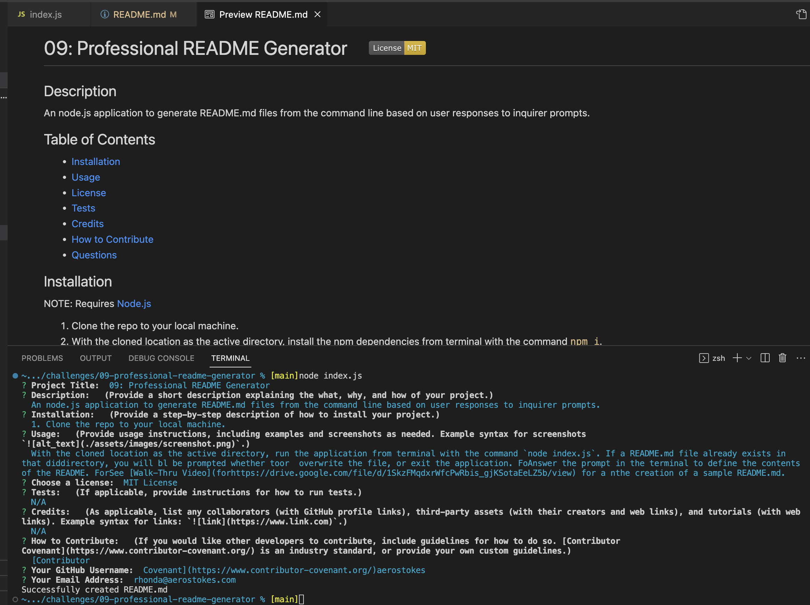

# 09: Professional README Generator     

## Description

An node.js application to generate README.md files from the command line based on user responses to inquirer prompts.  

## Table of Contents

- [Installation](#installation)
- [Usage](#usage)
- [License](#license)
- [Tests](#tests)
- [Credits](#credits)
- [How to Contribute](#how-to-contribute)
- [Questions](#questions)

## Installation
NOTE: Requires [Node.js](https://nodejs.org/en)
1. Clone the repo to your local machine.
2. With the cloned location as the active directory, install the npm dependencies from terminal with the command `npm i`.  

## Usage

With the cloned location as the active directory, run the application from terminal with the command `node index.js`.  
If a README.md file already exists in that directory, you will be prompted whether to overwrite the file, or exit the application.  
Answer the prompts in the terminal to define the contents of the README. 
See [Walk-Thru Video](https://drive.google.com/file/d/1SkzFMqdxrWfcPwRbis_gjKSotaEeLZ5b/view) for a detailed walk-thru of creating a sample README.md using VS Code's Integrated Terminal.

## License

This project is covered under the following license: MIT License  
Refer to LICENSE in the repo for additional details.

## Tests

N/A

## Credits

N/A

## How to Contribute

[Contributor Covenant](https://www.contributor-covenant.org/)

## Questions

For questions or suggestions, contact:  
GitHub: [@aerostokes](https://github.com/aerostokes)  
Email: [rhonda@aerostokes.com](mailto:rhonda@aerostokes.com)